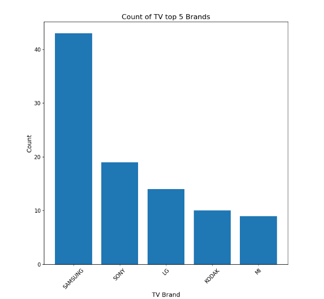
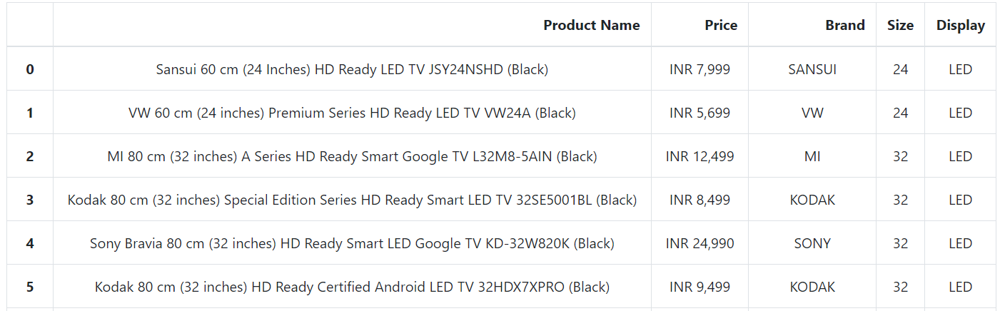

# Web Scraping AMAZON televisions data!!
**Project Idea:** The project involves scraping data from the ecommerce website *`www.amazon.in`* to gather information about the top 5 brands of new televisions and the list of available televisions with more details.

## Follow below steps to scrape the data using *amazon-televisions.ipynb* script.
- Navigate to the `web-scraping\scripts` folder.
- Open the `amazon-televisions.ipynb` script.
- Run each cell in the script.
- Upon completion of the script, a CSV file will be generated containing the scraped data under `miniproject\data` folder.

## To create a Django project, please follow the instructions below:

- Create a virtual environment using the command: `python -m venv .miniproj`
- Activate the newly created environment by running: `.\.miniproj\Scripts\activate`
- Install Django within the virtual environment using the command: `pip install Django`
- Verify the Django version by running: `python -m django --version`
- Create a Django project by executing: `django-admin startproject miniproject`

## To create user registration, login, and logout functionalities, please follow the instructions below:

- Create a Django users app by running the command: `django-admin startapp users`
- Create a folder named `templates/users` under the project folder and add the following UI files: `login.html`, `register.html`, and `dashboard.html`.
- Modify the `models.py` file to import the Django **User** model.
- Create register and login forms under the `forms.py` file.
- Add the register, login, logout, and dashboard functions under the `views.py` file.
- Define the URL paths for the user app by adding them to the `users/urls.py` file.
- In the `settings.py` file, specify the location of the templates directory by adding the following line: `TEMPLATES'DIRS': [BASE_DIR / 'templates']`
- Include the user app path in the project's main `urls.py` file.

## To run the application, execute the following commands:

- Activate the virtual environment by running: `.\.mproj\Scripts\activate`
- Run `python manage.py makemigrations` to create the necessary database migrations.
- Run `python manage.py migrate` to apply the migrations and create the database tables.
- Finally, start the application by running `python manage.py runserver`.
 